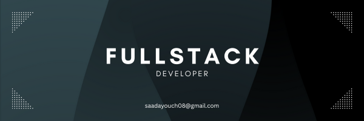

<h1 align="left">Hello World!, I'm Saad, a Moroccan Web Developer 👋🏼:</h1>

###

I am a Computer Science student with a passion for web development, specializing in front-end and back-end technologies.💡

###

<h2 align="left">🙋‍♂️ About me</h2>

###

🌍 Location: Salé, Morocco 
👨‍💻 Started Programming: 2021 
📚 Currently Working On: Completing the PHP Laravel Certification 
🎓 Plan: Working towards and completing the React Advanced Certification on Coursera 
🎯 Goals: Master the concepts of both backend and frontend development 
🤓 Fun Fact: I love solving complex coding challenges and view them as fun puzzles to crack!

###

<h2 align="left">💬 Contact</h2>

###

  📧 Email: saadayouch08@gmail.com 
  📞 Phone: 06 25 62 21 31  
  🔗 LinkedIn: <a href="https://www.linkedin.com/in/saad-ayouch-215a56243/" target="_blank">Saad Ayouch</a>

###

<h2 align="left">💻 Tech Stack:</h2>
                        
# 📊 GitHub Stats:
 
 

---

<!-- Proudly created with GPRM ( https://gprm.itsvg.in ) -->

<picture>
  <source media="(prefers-color-scheme: dark)" srcset="https://raw.githubusercontent.com/bellarab/bellarab/output/github-snake-dark.svg" />
  <source media="(prefers-color-scheme: light)" srcset="https://raw.githubusercontent.com/bellarab/bellarab/output/github-snake.svg" />
  
</picture>
###

  <h3>✍️ Random Dev Quote</h3>
  
    
  

###
